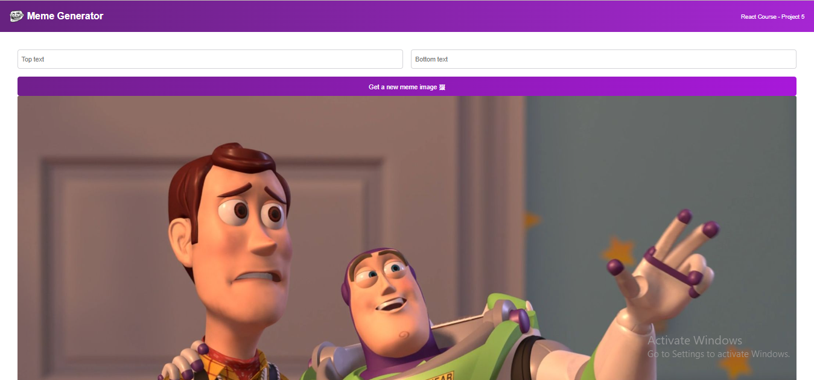

#  MEME-GENERATOR
 This is a fun react website for geenerating the memes. The code is approx finish.

 ## RESULT

 

 ## Problems / Solutions
 1. you need to be careful of typo error, I got frustated by this when I was using the useState, find out in the end that it was just a typo error. carefully write this while using useState import React, { useState } from 'react'; // Correct import statement.
 2. One small problem which I faced is that VS code show error when you don't use ALt attribute in image syntax of REACT JSX. so the simple solution is using of alt="" attributes in image.
 3. plus you can't use the reserving word in alt='' attribute like image, picture. This is wrong (alt="Hassan'image"), This is right (alt="Hassan's face")